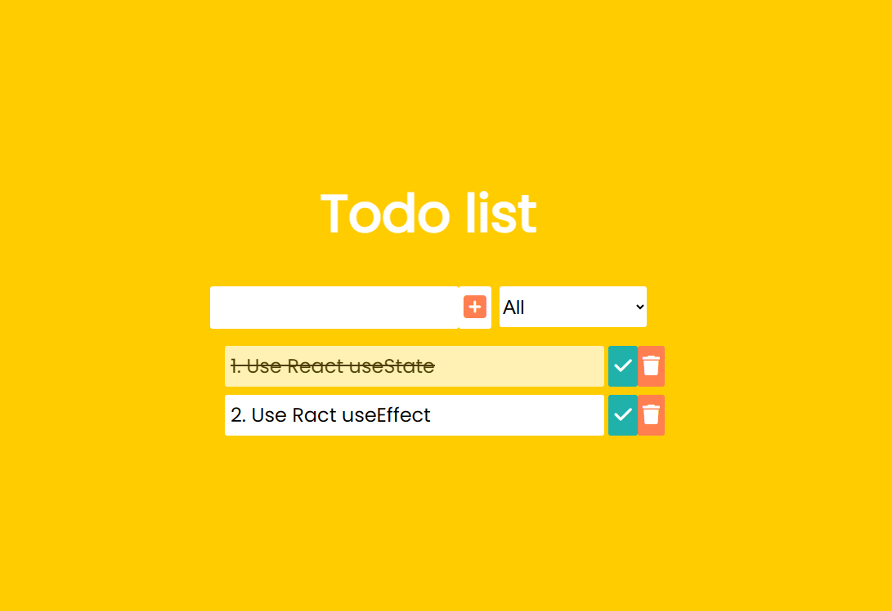

# React To-Do App for Task Planning

This is a React-based To-Do App that allows users to add, edit, delete, and mark tasks as complete or incomplete.  
You can check out the full tutorial that inspired this application here:  
["Build A Todo App With REACT"](https://www.youtube.com/watch?v=pCA4qpQDZD8)

## Available Features

- Add new tasks  
- Edit existing tasks  
- Delete tasks  
- Toggle task completion  
- Filter tasks (completed, uncompleted, all)  
- Save task data to temporary storage (local storage)

## Technologies Used

- **React**: useState, useEffect  
- **HTML & CSS**: Responsive layout and styling  
- **FontAwesome**: Icon support  
- **Google Fonts**: Custom typography  

## Additional Info

Through this project, I solidified my understanding of React hooks such as `useState` and `useEffect`.  
I also gained valuable experience in building a React application from start to finish.